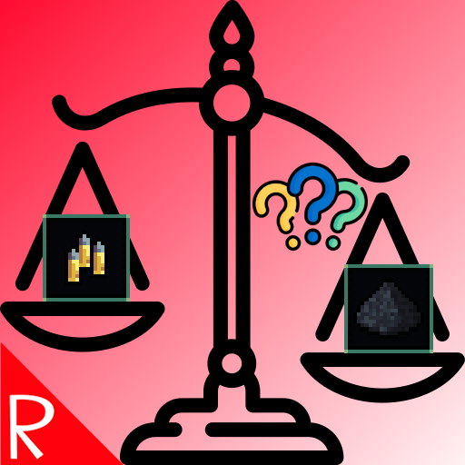

# Quasimorph Fix Gunpowder Weight

Fixes a bug where gun powder is 10x the weight of ammo.  For example, 9mm ammo weighs 0.01 each, while powder extracted from that round weighs 0.10.

Additionally, can optionally adjust ammo so that disassembling a round doesn't produce more components than it takes to make.  This is disabled by default.  Ex:  9mm ammo takes one powder to create, but can disassemble into as much as two powder.  This can be enabled with the config.

## Disassembly Output Fix
If the "fix disassembly outputs" is enabled, expect to get about half of the components that the non modded game returns.  As an example, since 9mm ammo can normally create up to two powder (0-2 random), adjusting that recipe to one (0-1 random) will reduce the output. For example, a stack of 9mm x 80 will generally return about 30-40 powder when modded, while the game's default will usually return about 80-100+.

## Mod Life
It is unknown how quickly the developers will address the "bug" in the game.  However it may be fairly soon; therefore it is unknown how long this mod will be needed.  This mod will be removed when the bugs are addressed.

# Configuration

## MCM
This mod supports the MCM, which adds a Mods button to the main menu.  The settings can be found there.
Alternatively, the config file can be directly edited, as indicated in the section below.

## Config File

The configuration file will be created on the first game run and can be found at `%AppData%\..\LocalLow\Magnum Scriptum Ltd\Quasimorph_ModConfigs\FixGunpowderWeight\config.json`.

|Name|Default|Description|
|--|--|--|
|FixPowderWeight|true|Changes powder to 0.01 from the incorrect 0.10|
|FixDisassemblytoAssemblyCount|false|If true, will change any disassembly outputs to not be more than what is required to make the same item.|

# Support My Work
If you enjoy my mods and want to buy me a coffee, check out my [Ko-Fi](https://ko-fi.com/nbkredspy71915) page.  It really helps with motivation to continue to support mods.
This is not expected, but appreciated. Thanks!

# Source Code
Source code is available on GitHub at https://github.com/NBKRedSpy/FixGunpowderWeight

# Credits

Icons from:

[Law icons created by LAFS - Flaticon](https://www.flaticon.com/free-icons/law)

[Question mark icons created by Freepik - Flaticon](https://www.flaticon.com/free-icons/question-mark)
